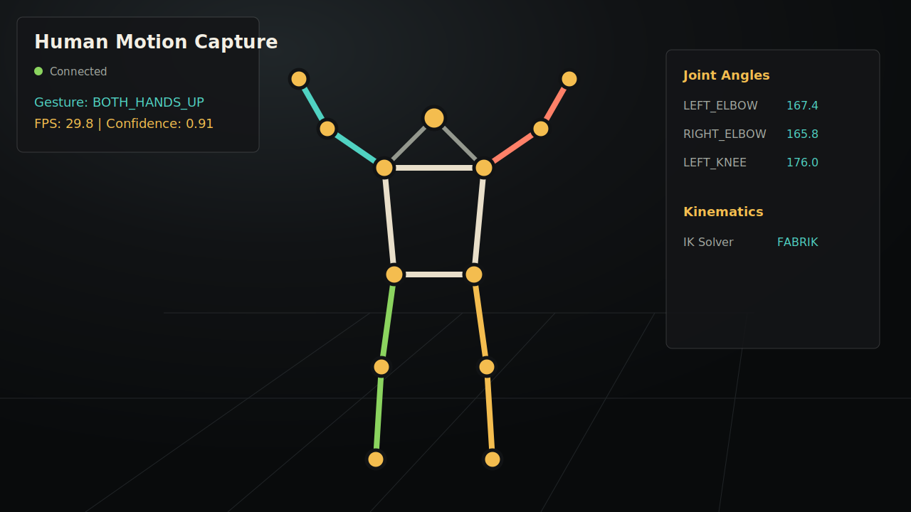

# Human Motion Capture

Dự án nhận dạng cử chỉ và chuyển động người bằng Python, MediaPipe Pose, OpenCV, FastAPI, WebSocket và Three.js. Backend đọc camera/video, trích xuất 33 landmarks của cơ thể, nhận dạng tư thế, tính FK/IK, ghi log CSV và stream skeleton 3D realtime lên trình duyệt.



## 1. Chức Năng Chính

- Đọc camera laptop, camera ảo từ điện thoại, URL camera hoặc video upload.
- Trích xuất MediaPipe Pose 33 landmarks với tọa độ 2D pixel, 3D world coordinate và visibility confidence.
- Vẽ skeleton 2D lên frame gốc bằng OpenCV, hiển thị FPS, pose hiện tại, góc khớp và confidence từng joint.
- Nhận dạng rule-based các gesture: `STANDING`, `SITTING`, `LEFT_HAND_UP`, `RIGHT_HAND_UP`, `BOTH_HANDS_UP`, `BENDING_FORWARD`.
- Ghi log kết quả vào `logs/gesture_log.csv` gồm `timestamp`, `detected_pose`, `confidence`.
- Tính Forward Kinematics: joint angles, bone lengths và hướng segment.
- Tính Inverse Kinematics bằng FABRIK cho chuỗi khớp cánh tay.
- Stream dữ liệu pose qua WebSocket `/ws/pose`.
- Render skeleton 3D trên browser bằng Three.js với `LineSegments`, `SphereGeometry`, OrbitControls và humanoid low-poly `SkinnedMesh`.
- UI có pause/resume, chọn source, upload video, toggle overlay, chuyển tỉ lệ `9:16`/`16:9`, fit/crop, rotate camera.
- Tối ưu low-latency cho camera điện thoại/Camo: giới hạn frame realtime, giảm buffer và ưu tiên frame mới.

## 2. Cấu Trúc Dự Án

```text
main.py                     FastAPI app, capture runtime, /ws/pose, /video_feed
pose_extractor.py           MediaPipe Pose wrapper trả về Joint/PoseFrame
gesture_classifier.py       Rule-based gesture/posture classifier
kinematics.py               Joint angles, FK summary, FABRIK IK
utils.py                    Math, landmark, JPEG, delta helpers
visualizer_2d.py            OpenCV skeleton overlay
motion_filter.py            EMA landmark smoothing
static/index.html           Browser UI
static/controls.js          Điều khiển UI và camera config
static/skeleton_renderer.js Three.js scene, skeleton, IK overlay
static/humanoid_mesh.js     Low-poly humanoid SkinnedMesh
static/websocket_client.js  WebSocket reconnect và FPS client
tests/                      Unit tests
logs/gesture_log.csv        File log gesture được tạo khi chạy
pose_landmarker.task        MediaPipe model, phải nằm ở project root
```

## 3. Cài Đặt Lần Đầu

Mở PowerShell tại thư mục dự án:

```powershell
cd d:\project
```

Tạo và kích hoạt môi trường ảo:

```powershell
python -m venv .venv
.\.venv\Scripts\Activate.ps1
```

Nếu PowerShell chặn activate script, chạy lệnh này trong đúng cửa sổ PowerShell hiện tại:

```powershell
Set-ExecutionPolicy -Scope Process -ExecutionPolicy Bypass
.\.venv\Scripts\Activate.ps1
```

Cài thư viện:

```powershell
pip install -r requirements.txt
```

Kiểm tra môi trường:

```powershell
python check_env.py
```

## 4. Chạy Demo

Chạy backend:

```powershell
uvicorn main:app --reload
```

Mở browser:

```text
http://localhost:8000
```

Kết quả mong đợi:

- Bên trái có khung camera 2D overlay.
- Ở giữa/phía sau là sàn WebGL 3D.
- Khi người dùng đứng trong khung hình, skeleton 3D và humanoid di chuyển theo.
- Góc phải hiển thị `Stream FPS`, `Backend FPS`, `Gesture`, `Confidence`.
- Panel `Joint Angles` và `Kinematics` cập nhật theo từng frame.

Nếu vừa sửa code Python mà web chưa đổi, dùng `Ctrl + C` để tắt server rồi chạy lại `uvicorn main:app --reload`.

## 5. Cách Dùng Nhanh Khi Demo

1. Chạy server bằng `uvicorn main:app --reload`.
2. Mở `http://localhost:8000`.
3. Chọn camera source.
4. Đứng cách camera 1.5 đến 2.5 mét để thấy đủ đầu, thân, tay, chân.
5. Bật/tắt các layer 2D overlay, skeleton 3D, humanoid và IK bằng toolbar dưới màn hình.
6. Thực hiện các tư thế: đứng thẳng, ngồi, giơ tay trái, giơ tay phải, giơ hai tay, cúi người.
7. Mở `logs/gesture_log.csv` để xem kết quả nhận dạng đã ghi lại.

## 6. Dùng Camera Laptop

Với camera laptop thông thường:

1. Nhập source:

```text
0
```

2. Bấm nút webcam/source trên toolbar.
3. Bấm nút tỉ lệ đến khi hiện:

```text
16:9
```

4. Để `fit` ở chế độ `contain` nếu muốn thấy toàn bộ khung hình, hoặc `cover` nếu muốn crop kín khung.

Nếu laptop có nhiều camera, bấm nút scan camera có icon kính lúp. Web sẽ quét các source khả dụng và điền source phù hợp vào ô input.

## 7. Dùng iPhone Làm Camera Bằng Camo

Cách này đang phù hợp nhất với máy hiện tại của dự án.

Nếu cần bản thao tác nhanh cho cả iPhone và Android, xem thêm `PHONE_CAMERA_QUICK_GUIDE.md`.

### Bước 1: Mở Camo

1. Cài Camo Studio trên Windows.
2. Cài app Camo trên iPhone từ App Store.
3. Kết nối iPhone với máy tính bằng cáp USB/Type-C.
4. Trên iPhone, bấm `Trust This Computer` nếu được hỏi.
5. Mở Camo Studio và đảm bảo preview trên Camo đã thấy hình từ iPhone.

### Bước 2: Chọn Source Trong Web

Trong web `localhost:8000`, có 2 cách:

```text
1@MSMF
```

Hoặc bấm nút scan camera, sau đó chọn source có dạng tương tự:

```text
1@MSMF
```

Trên máy này, `1@MSMF` là source đúng cho Camo/iPhone. `1@DSHOW` có thể mở được nhưng bị đen màn hình, nên không nên dùng nếu preview không có hình.

### Bước 3: Chỉnh Tỉ Lệ Cho iPhone

- Để `9:16` khi cam điện thoại đang dựng dọc.
- Bấm nút rotate nếu hình bị xoay ngang/sai chiều.
- Để `contain` để không mất người trong khung.
- Nếu muốn demo camera laptop thì chuyển lại `16:9`.

### Bước 4: Giảm Delay Cho iPhone

Trong Camo Studio, nên để:

```text
720p / 30 FPS
```

Nếu để 1080p hoặc 4K, MediaPipe phải xử lý nhiều hơn và có thể delay. Backend đã có `latency mode: low`, nhưng 720p vẫn là mức ổn định nhất cho demo realtime.

Khi chạy đúng, panel bên phải sẽ có các dòng gần như:

```text
source: 1@MSMF
backend: MSMF
camera mode: 9:16 / contain / 0 deg
latency mode: low
frame size: 405 x 720
```

## 8. Dùng Điện Thoại Để Mở Web

Nếu muốn mở giao diện trên điện thoại, máy tính và điện thoại phải chung Wi-Fi.

Chạy server trên LAN:

```powershell
uvicorn main:app --host 0.0.0.0 --port 8000
```

Xem IPv4 của máy tính:

```powershell
ipconfig
```

Mở trên browser điện thoại:

```text
http://COMPUTER_IPV4:8000
```

Nếu không vào được, hãy allow Python/uvicorn trong Windows Firewall.

## 9. Dùng Video Upload

1. Bấm nút upload trên toolbar.
2. Chọn file video `.mp4`, `.mov`, `.avi`, `.mkv` hoặc `.webm`.
3. Backend sẽ lưu file vào `uploads/` và tự động đổi source sang video đó.
4. Khi video chạy hết, backend sẽ tua lại từ đầu.

## 10. Toolbar Và UI Controls

| Nút | Chức năng |
| --- | --- |
| Ô source | Nhập `0`, `1@MSMF`, đường dẫn video, hoặc URL camera. |
| Kính lúp | Quét camera/webcam/virtual camera đang đọc được. |
| Webcam/source | Áp dụng source đang nhập trong ô input. |
| Upload | Upload video local và chạy pose trên video. |
| Pause | Tạm dừng hoặc tiếp tục capture. |
| 2D overlay | Bật/tắt khung OpenCV skeleton overlay. |
| `9:16` / `16:9` | Chuyển tỉ lệ camera cho điện thoại dọc hoặc laptop ngang. |
| Fit | Đổi giữa `contain` và `cover`. |
| Rotate | Xoay camera 90 độ mỗi lần bấm. |
| Skeleton | Bật/tắt skeleton 3D line + joint spheres. |
| Humanoid | Bật/tắt body mesh low-poly. |
| IK | Bật/tắt FABRIK IK overlay. |
| Grid | Bật/tắt mặt lưới sàn 3D. |
| Crosshair | Bật/tắt chế độ căn theo hip/root. |
| Reset | Reset OrbitControls camera. |

Góc phải màn hình hiển thị thông tin runtime:

- `Stream FPS`: FPS WebSocket nhận được trên browser.
- `Backend FPS`: tốc độ xử lý pose của Python backend.
- `Gesture`: tư thế/cử chỉ đang nhận dạng.
- `Confidence`: độ tin cậy của gesture.
- `Joint Angles`: các góc khớp đang tính được.
- `Kinematics`: FK/IK, bone count, source, frame size và thông tin camera.

## 11. Gesture Được Nhận Dạng

Classifier hiện tại dùng rule-based để dễ giải thích khi báo cáo.

| Gesture | Mô tả rule |
| --- | --- |
| `STANDING` | Đầu gối và hông khá duỗi, người đứng thẳng. |
| `SITTING` | Đầu gối/hông gập nhiều, tỉ lệ giống tư thế ngồi. |
| `LEFT_HAND_UP` | Cổ tay trái nằm cao hơn vai trái trong tọa độ ảnh. |
| `RIGHT_HAND_UP` | Cổ tay phải nằm cao hơn vai phải trong tọa độ ảnh. |
| `BOTH_HANDS_UP` | Cả hai tay đều thỏa điều kiện giơ lên. |
| `BENDING_FORWARD` | Thân người nghiêng/cúi về phía trước, đầu thấp hơn so với vai/hông. |
| `NO_PERSON` | Không phát hiện đủ landmarks người. |
| `UNKNOWN` | Có người nhưng confidence các rule chưa đủ cao. |

MediaPipe visibility được dùng để giảm confidence khi joint bị che khuất hoặc nằm ngoài khung hình.

## 12. Kinematics Và IK

Forward Kinematics trong dự án gồm:

- Tính góc vai, khuỷu tay, hông, đầu gối bằng 3 landmarks.
- Tính độ dài từng bone theo MediaPipe world coordinates.
- Tính vector hướng cho từng segment của skeleton.

Inverse Kinematics dùng FABRIK cho chuỗi cánh tay:

1. Giữ root shoulder cố định.
2. Đặt wrist/end-effector về target.
3. Backward pass từ wrist về shoulder, giữ nguyên độ dài bone.
4. Forward pass từ shoulder về wrist, tiếp tục giữ độ dài bone.
5. Lặp đến khi sai số nhỏ hơn tolerance hoặc hết số lần lặp.

IK overlay trên browser giúp so sánh chuỗi tay gốc với chuỗi FABRIK đã solve.

## 13. File Log CSV

Kết quả nhận dạng được ghi vào:

```text
logs/gesture_log.csv
```

Định dạng:

```text
timestamp,detected_pose,confidence
2026-06-08T10:30:12.123,RIGHT_HAND_UP,0.8421
```

Có thể xóa file log cũ trước khi demo. Khi chạy lại, backend sẽ tự tạo file mới.

## 14. API Quan Trọng

| Endpoint | Chức năng |
| --- | --- |
| `/` | Mở giao diện Three.js. |
| `/ws/pose` | WebSocket stream joint data JSON mỗi frame. |
| `/video_feed` | MJPEG stream của OpenCV overlay. |
| `/snapshot.jpg` | Ảnh snapshot mới nhất của overlay. |
| `/api/state` | Trạng thái backend hiện tại. |
| `/api/cameras` | Quét camera/virtual camera. |
| `/api/source` | Đổi camera/video source. |
| `/api/camera-config` | Đổi aspect, fit, rotate. |
| `/api/pause` | Pause/resume capture. |
| `/api/upload` | Upload video local. |

## 15. Lỗi Thường Gặp

### Không phát hiện người

- Đứng lùi ra để thấy đủ thân người, đặc biệt vai, hông, đầu gối.
- Tăng ánh sáng, tránh đứng ngược sáng.
- Kiểm tra khung 2D overlay có thật sự thấy người không.
- Với iPhone, dùng `9:16` và `contain` để không crop mất chân/tay.
- Nếu chỉ thấy tường/sàn nhà, hãy chỉnh lại góc đặt camera.

### Camera đen màn hình

- Với Camo/iPhone, thử source:

```text
1@MSMF
```

- Không dùng `1@DSHOW` nếu backend báo có camera nhưng khung hình đen.
- Đóng các app đang chiếm camera như Zoom, Teams, OBS, browser tab khác.
- Mở Camo Studio trước, đảm bảo Camo đã hiện preview từ iPhone.

### Delay khi dùng iPhone

- Trong Camo Studio, chọn `720p / 30 FPS`.
- Dùng source `1@MSMF`.
- Để camera mode `9:16 / contain / 0 deg` nếu quay dọc.
- Kiểm tra panel bên phải có `latency mode: low`.
- Nếu `Backend FPS` dưới 10, giảm resolution Camo hoặc tắt bớt app nặng.

### Web không cập nhật UI mới

- Bấm `Ctrl + F5` trên browser.
- Tắt và chạy lại server:

```powershell
Ctrl + C
uvicorn main:app --reload
```

### Điện thoại không vào được web LAN

- Chạy server với `--host 0.0.0.0`.
- Kiểm tra máy tính và điện thoại cùng Wi-Fi.
- Allow Python/uvicorn trong Windows Firewall.

## 16. Test

Chạy unit tests:

```powershell
python -m unittest discover -s tests
```

Smoke test riêng MediaPipe + OpenCV:

```powershell
python pose_extractor.py
```

Bấm `q` để đóng cửa sổ OpenCV.

## 17. Checklist Khi Báo Cáo

- Mở `localhost:8000` và hiển thị skeleton 3D realtime.
- Bật 2D overlay để thấy FPS, skeleton OpenCV, confidence từng joint.
- Thực hiện ít nhất 3 gesture và chỉ ra label thay đổi trên UI.
- Mở `logs/gesture_log.csv` để chứng minh có ghi log.
- Bật panel `Joint Angles` để trình bày FK/joint angles.
- Bật IK overlay để trình bày FABRIK cho cánh tay.
- Chuyển `16:9` cho camera laptop và `9:16` cho iPhone để demo UI controls.
- Giải thích WebSocket `/ws/pose` gửi JSON joints sang Three.js.
